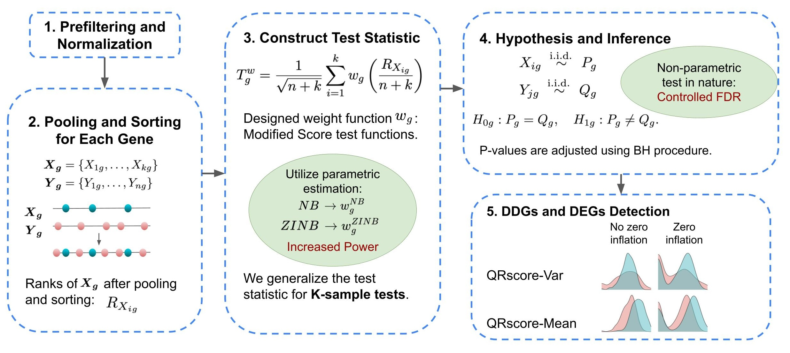

# QRscore

QRscore is an R package designed for analysis of differentially expressed genes 
(DEGs) and differentially dispersed genes (DDGs). The workflow is shown 
in the following figure.



## Installation

QRscore requires the following packages to run effectively:

```r
if (!requireNamespace("BiocManager", quietly = TRUE)) {
    install.packages("BiocManager")
}
if (!requireNamespace("DESeq2", quietly = TRUE)) {
    BiocManager::install("DESeq2")
}
```


You can install the **QRscore** package from 
[Bioconductor](https://bioconductor.org) with the following command:

```r
if (!requireNamespace("QRscore", quietly = TRUE)) {
    BiocManager::install("QRscore")
}
```

Alternatively, you can install the **QRscore** package from github:

```r
if (!requireNamespace("devtools", quietly = TRUE)) {
    install.packages("devtools")
}
devtools::install_github("Fanding-Zhou/QRscore")
```

## Loading QRscore

After installation, load QRscore and its dependencies:

```r
library(QRscore)
library(DESeq2)
```

## Usage

Here’s a brief example of how to use QRscore in your analysis pipeline:

1. **Preparing Data**: QRscore takes in RNA-seq count matrix and group labels 
as input and perform prefiltering and normalization.

```r
data("example_dataset_raw_3000_genes")

bulk_sparse_mat = example_dataset_raw_3000_genes$COUNTS
ages = example_dataset_raw_3000_genes$METADATA$AGE

## filter out low expressed genes
col_means <- colMeans(bulk_sparse_mat, na.rm = TRUE)
col_zeros <- colMeans(bulk_sparse_mat==0, na.rm = TRUE)
col_ids <- which(col_means>5&col_zeros<0.2) # The threshold can be modified

## normalization
bulk_df = bulk_sparse_mat[,col_ids]
bulk_df_inv = t(bulk_df)
coldata = data.frame(age = ages)
dds <- DESeqDataSetFromMatrix(countData = bulk_df_inv,
                                colData = coldata,
                                design = ~ age)
dds = estimateSizeFactors(dds)
normalized_mat <- counts(dds, normalized=TRUE)
```

2. **Running Analysis**: Example code for setting up and performing the QRscore 
analysis.

```r
kept_samples = coldata$age %in% c("40-49", "60-69")
normalized_mat = normalized_mat[, kept_samples]
coldata = coldata[kept_samples,]
results <- QRscoreGenetest(normalized_mat_1, coldata_1, pairwise_test = TRUE,
pairwise_logFC = TRUE, test_mean = TRUE, test_dispersion = TRUE, num_cores = 4,
approx = "asymptotic")
```

3. **Interpreting Results**: QRscore outputs include differential expression 
and differential dispersion p-values, together with log Fold Change and 
log Variance Change. 


## License

GPL (>= 3)


## References

For more information and detailed usage, refer to the QRscore vignette, 
documentation and package help files.
